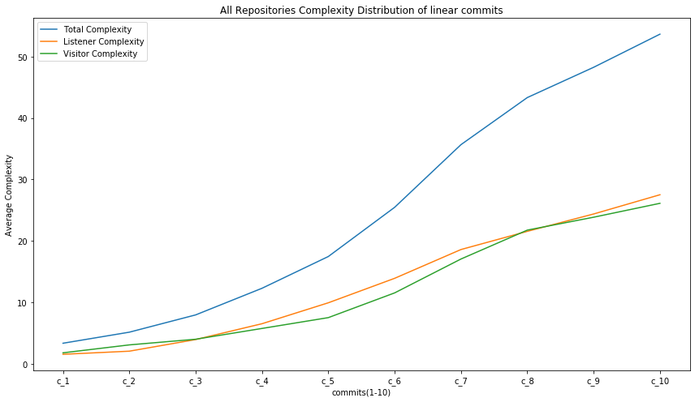

# MSR-3
Mining Software Repositories Project to analyze Java projects to extract information regarding the evolution of antlr4 patterns.

# Grammar Used
Java grammar used in this project is taken from https://github.com/antlr/grammars-v4/tree/master/java. 

# Project Setup on Linux Distributions:

Build instructions -- Tools needed : VScode(any text editor), Jupyter Notebook must be installed on the system.

1) Install Antlr4 using below commands.

    ```
    a) cd /usr/local/lib
    b) sudo curl -O https://www.antlr.org/download/antlr-4.7.2-complete.jar
    c)  vi /home/{user_account)name}/.bashrc 
            and add  below commands at the end.

        export CLASSPATH=".:/usr/local/lib/antlr-4.7.2-complete.jar:$CLASSPATH"
        alias antlr4='java -jar /usr/local/lib/antlr-4.7.2-complete.jar'
        alias grun='java org.antlr.v4.gui.TestRig'

    d) source /home/{user_account)name}/.bashrc
    e) pip install antlr4-python3-runtime
    ```
2) Install below third party libraries using below commands
    
    ```
    a) Install python 3.7.4
    sudo apt-get install python3=3.7.4*

    b) Install numpy 1.17.2
    pip install numpy==1.17.2

    c) Install pandas 0.25.1
    pip install pandas==0.25.1

    d) Install matplotlib 3.1.1
    pip install matplotlib==3.1.1

    e) Install GitPython 3.1.0
    pip install GitPython==3.1.0

    ```

3) Download this github repository and open with vscode(any text editor) and install any extensions if needed.

    ```
    wget https://github.com/praveengadiyaram369/MSR-3.git
    or 
    git clone https://github.com/praveengadiyaram369/MSR-3
    ```
   
4) Generate Lexer and parsers for Python Runtime from antlr4 using below commands

   ```
   antlr4 -Dlanguage=Python3 Javalexer.g4
   antlr4 -Dlanguage=Python3 JavaParser.g4
   ```
    
5) Copy repository_mining_data.csv and clone_repositories.sh to a folder(eg:- repositories/) and execute script as below to download all repositories.

    ```
    sh clone_repositories.sh >> clone_repo_log.log
    ```

# Run Instructions:

1) Clear the contents of below 3 text file.

    ```
    a) Data_Config_Info/repo_names_done_1.txt
    b) Data_Config_Info/repo_names_done_2.txt
    c) Data_Config_Info/repo_names_done_3.txt
    ```
2) Check the paths inside the shell script(perform_commit_analysis.sh) are appropriate. You need to only check the path of the Python installed on your local system, rest of the parameters are configured properly in the script itself. All the 438 repositories are divided into 3 parts of (150, 150, 138) respectively.

    ```
    a) vim perform_commit_analysis.sh
    b) executable_python_path GitCommitAnalyzer.py #repository_path #input_repo_data.csv #output_repo_data.csv
    ```

3) Use below command to execute the python script and mine all the repositories. Logs would be automatically written into analysing_repos_pattern_evolution.log and use '&' at the end to make the script run in background.

    ```
    sh perform_commit_analysis.sh & 
    ```
  
3) Script can be re-executed at any time, it will always continue to process from the repository which was left last time.
  Inorder to restart the complete process of mining, start again from step 1 and reexecute.

4) Once all repositories are mined, we need to execute GenerateConsolidatedJson.py python script to consolidate all individual repository Json files to a single Json file.

    ```
    executable_python_path GenerateConsolidatedJson.py
    ```

5) Visualize the mined data and Validate the analysis by executing AnalyzingCommitHistories.ipynb on jupyter-notebook.

# Project Results:

1) Mining Data Table


2) Antlr4 Pattern Usage


3) Patterns Method count distribution


4) Listener Pattern Method count distribution

