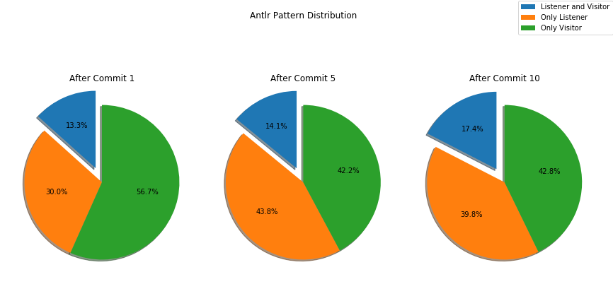

# MSR-3
Mining Software Repositories Project to analyze Java projects to extract information regarding the evolution of antlr4 patterns.

# Grammar Used
Java grammar used in this project is taken from https://github.com/antlr/grammars-v4/tree/master/java. 

# Project Setup on Linux Distributions:

Build instructions -- Tools needed : VScode(any text editor), Jupyter Notebook must be installed on the system.

1) Install Antlr4 using below commands.

    ```
    a) cd /usr/local/lib
    b) sudo curl -O https://www.antlr.org/download/antlr-4.7.2-complete.jar
    c)  vi /home/{user_account)name}/.bashrc 
            and add  below commands at the end.

        export CLASSPATH=".:/usr/local/lib/antlr-4.7.2-complete.jar:$CLASSPATH"
        alias antlr4='java -jar /usr/local/lib/antlr-4.7.2-complete.jar'
        alias grun='java org.antlr.v4.gui.TestRig'

    d) source /home/{user_account)name}/.bashrc
    e) pip install antlr4-python3-runtime
    ```
2) Install below third party libraries using below commands
    
    ```
    a) Install python 3.7.4
    sudo apt-get install python3=3.7.4*

    b) Install numpy 1.17.2
    pip install numpy==1.17.2

    c) Install pandas 0.25.1
    pip install pandas==0.25.1

    d) Install matplotlib 3.1.1
    pip install matplotlib==3.1.1

    e) Install GitPython 3.1.0
    pip install GitPython==3.1.0

    ```

3) Download this github repository and open with vscode(any text editor) and install any extensions if needed.

    ```
    wget https://github.com/praveengadiyaram369/MSR-3.git
    or 
    git clone https://github.com/praveengadiyaram369/MSR-3
    ```
   
4) Generate Lexer and parsers for Python Runtime from antlr4 using below commands

   ```
   antlr4 -Dlanguage=Python3 Javalexer.g4
   antlr4 -Dlanguage=Python3 JavaParser.g4
   ```
    
5) Copy repository_mining_data.csv and clone_repositories.sh to a folder(eg:- repositories/) and execute script as below to download all repositories.

    ```
    sh clone_repositories.sh >> clone_repo_log.log
    ```

# Run Instructions:

1) Clear the contents of below 3 text file.

    ```
    a) Data_Config_Info/repo_names_done_1.txt
    b) Data_Config_Info/repo_names_done_2.txt
    c) Data_Config_Info/repo_names_done_3.txt
    ```
2) Check the paths inside the shell script(perform_commit_analysis.sh) are appropriate. You need to only check the path of the Python installed on your local system, rest of the parameters are configured properly in the script itself. All the 438 repositories are divided into 3 parts of (150, 150, 138) respectively.

    ```
    a) vim perform_commit_analysis.sh
    b) executable_python_path GitCommitAnalyzer.py #input_repo_data.csv #output_repo_data.csv
    ```

3) Use below command to execute the python script and mine all the repositories. Logs would be automatically written into analysing_repos_pattern_evolution.log and use '&' at the end to make the script run in background.

    ```
    sh perform_commit_analysis.sh & 
    ```
  
3) Script can be re-executed at any time, it will always continue to process from the repository which was left last time.
  Inorder to restart the complete process of mining, start again from step 1 and reexecute.

4) Once all repositories are mined, we need to execute GenerateConsolidatedJson.py python script to consolidate all individual repository Json files to a single Json file.

    ```
    executable_python_path GenerateConsolidatedJson.py
    ```

5) Visualize the mined data and Validate the analysis by executing AnalyzingCommitHistories.ipynb on jupyter-notebook.

    ```
    open AnalyzingCommitHistories.ipynb and Run All cells.
    ```

# Research Questions:

**RQ1 – How the number of visitors and listener patterns evolve in the development of a project?**

**RQ2 – Do developers switch between visitor and listener patterns?**

# Methodology:

There are a total of 438 repositories which are to be mined and most of them have a total commits of thousand or higher. We calculated a total number of 1444977 commits for all repositories. That means it is not computable to check all commits of all projects. Still we want to analyze how the number of antlr-methods evolves.

To get a good understanding how the number of antlr-methods evolves and reduce the complexity of the problem we used these simplified methodology:

**Step 1:** We start to analyze all files of the project after its last commit(HEAD). We save all filenames of antlr-files in a list and also to a commit dictionary to save the pairs of commit-number and the number of antlr-methods{commit_no: commit_complexity}.

**Step 2:** Now we analyze just the antlr-files we got from Step-1 after the first commit and calculates the complexity to add the pair of commit no and complexity to commit dictionary.

**Step 3:** We sort the list by the commit-number and calculate commits between which two entries there is the maximal complexity difference. In between these two entries we analyze our next commit (middle commit) and save its complexity to the commit dictionary.

**Step 4:** We repeat step 3 till we reach 10 analyzed commits.

**step 5:** If we still cannot reach 10 analyzed commits, we'll pick few random commits and analyze them, until we reach 10 analyzed commits.

With this methodology we are able to approximate the function of antlr-methods by time for each repository better than using commits with equidistant timestamps or commit-number. As the data is un-structured, we are not sure of how many antlr file would exist at each commit, we cannot store the processed information in Tabular format(.csv). So we have stored the Final Repository data in JSON format (refer to  final_repo_data.json).

**Notes:** 
At each step once the commit is analyzed, a list is maintained to keep the details of the commit objects and also only antlr files are being processed which are analyzed from the last commit/HEAD. we are parsing complete file at each processed commit and whole file complexity is saved, not just the change.


# Findings:

**RQ1 – How the number of visitors and listener patterns evolve in the development of a project?**


**RQ2 – Do developers switch between visitor and listener patterns?**




# Testing:

1) Execute Test_GitAnalyzer.py python script to run unit test cases for the repository "meridor/perspective-backend". This test module is made just to validate results of the Repository Analysis and it is capable to test only one repository at a time. if any other repository needs to tested, then it should be configured properly inside Data_Config_Info/repository_mining_data_sample.csv and also inside Test_GitAnalyzer.py.

    ```
    executable_python_path Test_GitAnalyzer.py
    ```